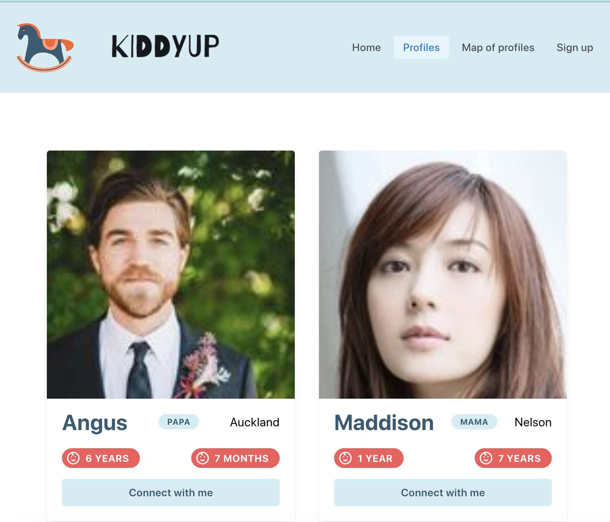

# Kiddyup - Parent Meetup Platform

An online platform for parents to connect with other parents.  
Users can search for other parents by list view or by map view. The map view allows parents to find other parents in their geolocation.
The platform has functionality for a user to enter their profile, including details on their children, their hobbies and location.
The platform has fetches initial seed data from the randomuser.me API.

## Screenshot of Kiddyup website

## Dependencies

This project uses the following systems:

- [Randomuser API](https://randomuser.me/)
- [React](https://github.com/facebook/react)
- [React Router](https://reactrouter.com/docs/en/v6)
- [Mantine](https://mantine.dev/)
- [Google Map React](https://www.npmjs.com/package/google-map-react)
- [Mongoose](https://mongoosejs.com/)
- [Express](https://expressjs.com/)

## Dev dependencies

- [Prettier](https://prettier.io/)
- [Stylelint](https://stylelint.io/)
- [Jest](https://jestjs.io/)

## Prerequisites

- [Node](https://nodejs.org/)

## Local development

1. Run `npm install`
2. Run `npm start` to start the development server
3. Open `src/App.js` to get started

## Deployed applications

- [Kiddyup](https://planitevents.netlify.app/)

## Citations

- Header image from: [Unsplash - Photo by Med Mhamdi](https://unsplash.com/photos/mH_E0K581Yk)
- Logo created on: [Canva](https://www.canva.com/)
- Favicon created on: [Canva](https://www.canva.com/)
