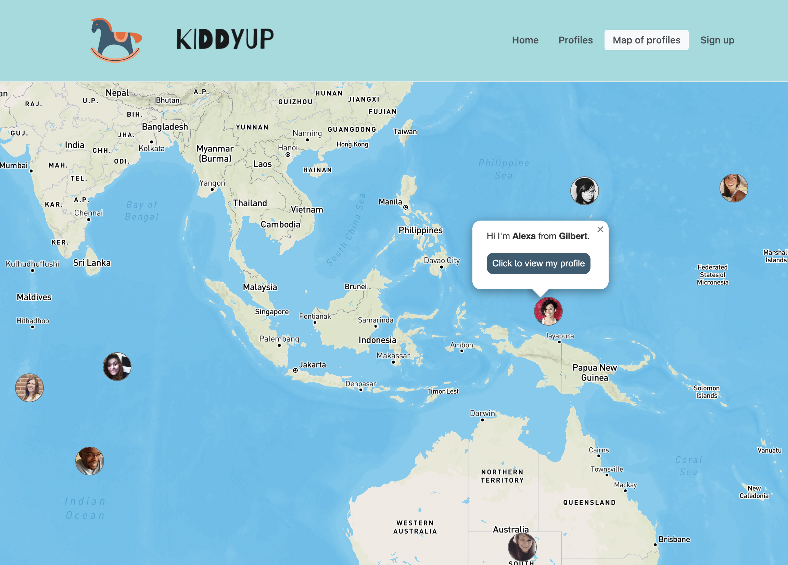

# Kiddyup - Parent Meetup Platform

An online platform for parents to connect with other parents.  
Users can search for other parents by list view or by map view. The map view allows parents to find other parents in their geolocation.
The platform has functionality for a user to enter their profile, including details on their children, their hobbies and location.
The platform has fetches initial seed data from the randomuser.me API.

## Screenshot of Kiddyup profile view

## Screenshot of Kiddyup map view

## Screenshot of Kiddyup home view

## Screenshot of Kiddyup form view

## Dependencies

This project uses the following systems:

- [Randomuser API](https://randomuser.me/)
- [React](https://github.com/facebook/react)
- [React Router](https://reactrouter.com/docs/en/v6)
- [Mantine](https://mantine.dev/)
- [Google Map React](https://www.npmjs.com/package/google-map-react)
- [Mongoose](https://mongoosejs.com/)
- [Express](https://expressjs.com/)

## Dev dependencies

- [Prettier](https://prettier.io/)
- [Stylelint](https://stylelint.io/)

## Prerequisites

- [Node](https://nodejs.org/)
- [Docker](https://docs.docker.com/get-docker/)

## Local development

1. Navigate to server (`cd server`)
2. Run `npm install` in server
3. Run `docker-compose up` in server
4. Connect to mongodb via MongoDB compass (`mongodb://localhost:27017/kiddyup`)
5. Run `npm run seed` to seed the database
6. Navigate to client (`cd client`)
7. Run `npm install` in client
8. Run `npm start` in client to start the react app

## Deployed applications

- [Kiddyup](http://......) - to be updated once deployed

## Citations

- Logo created on: [Canva](https://www.canva.com/)
- Favicon created on: [Canva](https://www.canva.com/)
- Hero image from: [UnDraw](https://undraw.co/)
